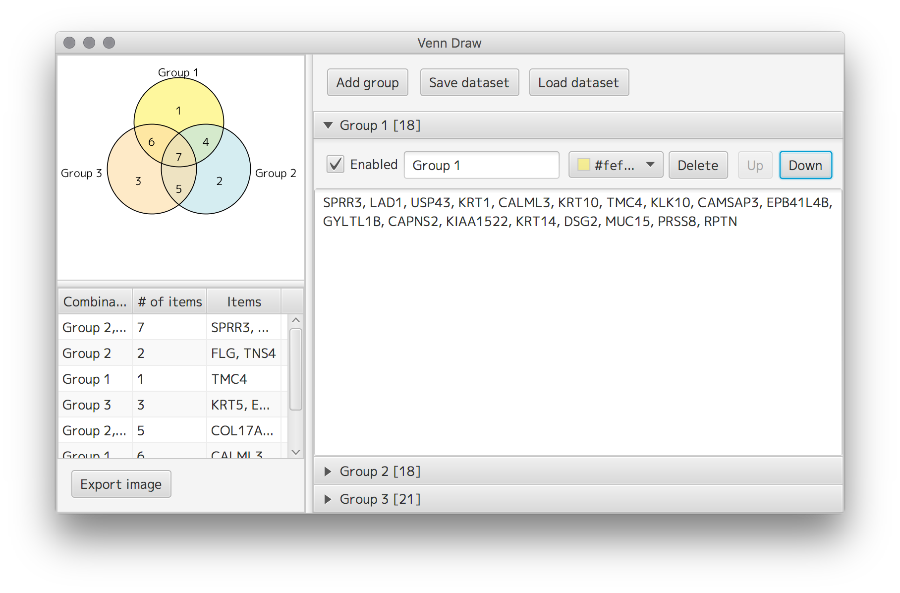

Venn Draw
=========

Venn Diagram Draw

Screenshot
----------

Download
--------

Binary distribution files are available at [Release](https://github.com/informationsea/VennDraw/releases) page.
Please install Java 8 update 40 or later to run if you downloaded zipped file. Other files, `dmg` and `exe`, 
included Java Runtime Environment to run. 

License
-------

GNU GPL 3 or later.

Copyright (C) 2016 Yasunobu OKAMURA All Rights Reserved.

Following open source softwares are included in binary distribution.

* TableIO : Copyright (C) 2015 Yasunobu OKAMURA All Rights Reserved
* OpenCSV : Copyright (C) OpenCSV development team
* Apache Batik: Copyright (C) Apache XML Graphics Project
* Apache Commons: Copyright (C) The Apache Software Foundation.
* Apache POI: Copyright (C) The Apache Software Foundation.
* Apache PDFBox: Copyright (C) The Apache Software Foundation.
* Xalan: Copyright (C) The Apache Software Foundation.
* Slf4j: Copyright (c) 2004-2013 QOS.ch All rights reserved.
* NSMenuFX: Copyright (c) 2015, codecentric AG All Rights Reserved.
* args4j: Copyright (C) 2003-2016 Kohsuke Kawaguchi
* M+ FONT: Copyright (C) 2015 Kouji Morishita
* sRGB Color Space Profile.icm: Copyright (c) 1998 Hewlett-Packard Company

Requirements
------------

* Java Runtime Environment 8 update 40 or later

How to build
-----------

* run `./gradlew build` and `./gradlew executableJar`

